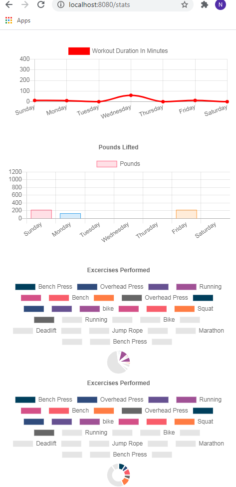
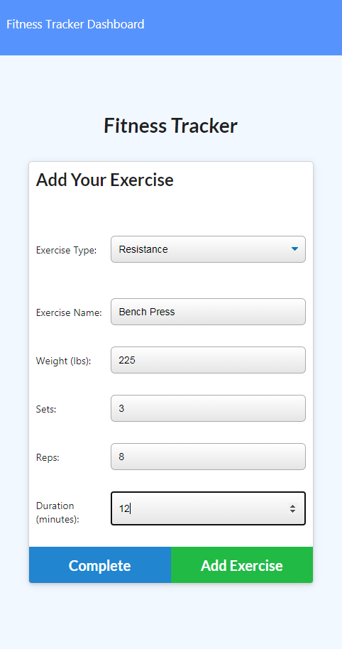

# fitness_Tracker

## Description

fitness_Tracker is a full-stack application using Node.js, Express,  and Mongoose. 

This demonstrates usage of C-R-U-D in a realistic scenario by tracking a user's workouts, and recording the progress so it can be analyzed using the stats page. The tracker works for both resistance and cardio training.

## DEPLOYED SITE:
https://linkgoeshere.herokuapp.com/

## Table of Contents

* [Installation](#installation)
* [Usage](#usage)

## Installation

Simply clone the repo, install the package and run, and/or visit the deployed page link to begin.

## Usage
 
 

## Questions

Contact [Nlamonaco86](mailto:nlamonaco86@gmail.com) with any questions or suggestions!
